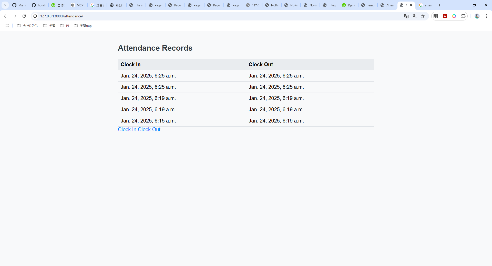
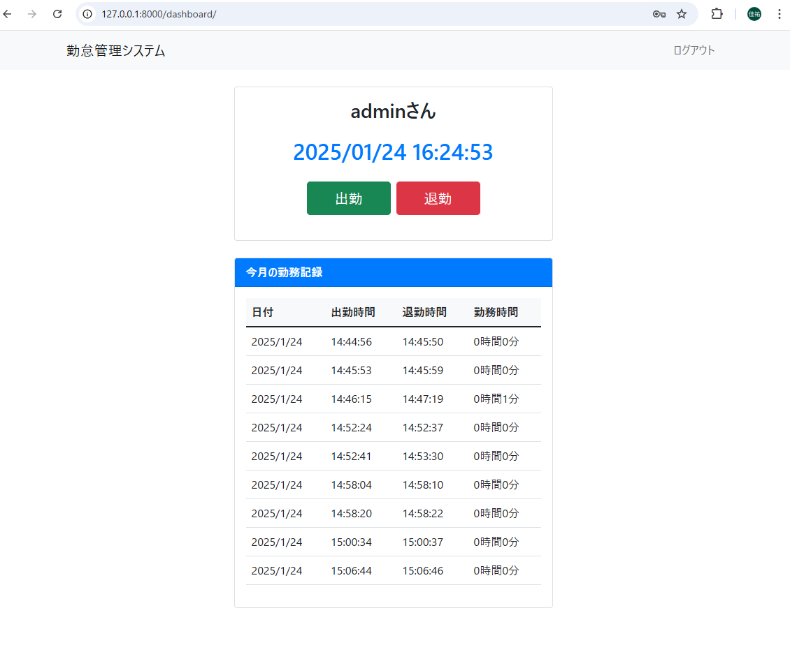
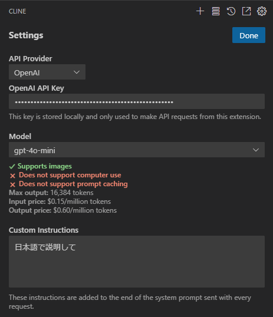
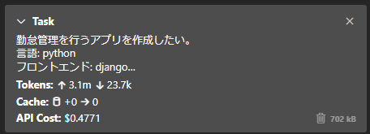

# Cline 検証 1

## 概要

- 検証日: 2025/01/24
- 検証者: 鈴木・本田
- 検証内容:
  - 2 人とも勤怠管理アプリ作成
  - 鈴木: OpenAI モデル(4o-mini,4o)を使用し Cline の機能を検証
  - 本田: Clude3 モデル(Clude3-5-haiku-20241022)を使用し Cline の機能を検証

## TL;DR

- Clude3 は実用性高そう
- windows 使っている場合、windows のパス形式を提示してくれるため bash を使用している場合注意が必要
  - 明確にコマンドプロンプトに bash を使用することを伝える必要がある

## 検証結果

- OpenAI モデル 4o-mini による検証では、AI がエラー原因を解決できず、無限ループが起きた。多少の手直しが必要。
- OpenAI モデル 4o による検証では、$3.9213 で高速に勤怠アプリを作成する事ができた。高価な分スピードが速い。
- Clude3 モデルによる検証では、下記仕様を満たした勤怠管理アプリを$0.9942 で作成することができた
  - テストコードについても作成することができた

### 作成した勤怠アプリの環境・仕様について

- 仕様
  1. ユーザー認証
  2. 出勤・退勤の打刻
  3. 勤務時間の記録
  4. 勤務履歴の表示
  5. レポート生成
- 環境
  - 言語: Python
  - フレームワーク
    - Frontend: Django
    - Backend: Django
  - DB: SQLite

### OpenAI モデル(4o-mini,4o)による検証

#### 成果物



- 一回目
  - Model：4o-mini
  - 成果：エラーが解決できず失敗
  - 作成されたコード：[https://github.com/hayatasuzuki15/cline-test-app/tree/cline-test-openai](https://github.com/hayatasuzuki15/cline-test-app/tree/cline-test-openai)
  - 
- 二回目
  - Model：4o-mini
  - 成果：エラーが解決できず失敗
  - 作成されたコード：[https://github.com/hayatasuzuki15/cline-test-app/tree/cline-test-openai-2](https://github.com/hayatasuzuki15/cline-test-app/tree/cline-test-openai-2)
- 三回目
  - Model：4o
  - 成果：成功
  - 作成されたコード：[https://github.com/hayatasuzuki15/cline-test-app/tree/cline-test-openai-3-4o](https://github.com/hayatasuzuki15/cline-test-app/tree/cline-test-openai-3-4o)

#### コストについて

- 一回目

```
Tokens: ↑284.0k, ↓2.3k
API Cost:$0.0440

Tokens: ↑213.4k, ↓3.4k
API Cost:$0.0341
```

- 二回目

```
Tokens: ↑3.1m, ↓23.7k
API Cost: $0.4771
```

- 三回目

```
Tokens: ↑764.3k, ↓6.7k
API Cost:$3.9213
```

#### 料金体系

##### 4o-mini

```
Supports images
Does not support computer use
Does not support prompt caching
Max output: 16,384 tokens
Input price: $0.15/million tokens
Output price: $0.60/million tokens
```

##### 4o

```
Supports images
Does not support computer use
Does not support prompt caching
Max output: 4,096 tokens
Input price: $5.00/million tokens
Output price: $15.00/million tok
```

#### 所感

- 環境構築から任せると、実行環境の違いによってエラーが起き、無限ループに陥る可能性がある。
  - 例：python の仮想環境にアクセスする時に windows における bash の場合、`venv/scripts/activate`を使用する必要があるのに、`venv/bin/activate`,`venv/scripts/activate.bat`を使用しようと何度も試みていた。
- 4o モデル使用時には、事前に環境を作成してからアプリ作成をお願いしたところ、スムーズな作成を実現できた。

### Clude3 モデル(Clude3-5-haiku-20241022)による検証

#### 成果物



- 1 度目で下記仕様を満たした勤怠管理アプリを作成することができた
  - [作成した勤怠アプリの環境・仕様について](#作成した勤怠アプリの環境・仕様について)の仕様のうち、1,2,3,4,を満たした
  - テストコードについても作成することができた
- 作成されたコードは、https://github.com/hayatasuzuki15/cline-test-app/tree/cline-test-clude3 を参照
  - コードのステップ数: 536,734 lines

#### コストについて

- API Cost: $0.9942
- Tokens: ↑6, ↓34.2k
- Cache: +645.7k →2.6m

料金体系

```
Does not support images
Does not support computer use
Supports prompt caching
Max output: 8,192 tokens
Input price: $0.80/million tokens
Cache writes price: $1.00/million tokens
Cache reads price: $0.08/million tokens
Output price: $4.00/million tokens
```

#### 所感

##### ポジティブ

- 勤怠管理アプリの仕様の確認から行ったが、いい回答が返ってきた
  - Q: 「勤怠管理を行うアプリを作成したい。必要な構成を教えて。」
  - A: 「勤怠管理アプリの基本的な構成について、以下のように提案します。
    勤怠管理アプリには、以下の主要な機能が必要です： 1. ユーザー認証 2. 出勤・退勤の打刻 3. 勤務時間の記録 4. 勤務履歴の表示 5. レポート生成
    技術スタックとしては、モダンなウェブアプリケーションに適した React + Node.js を使用するのが良いでしょう。
    プロジェクトの基本構造を作成します： mkdir attendance-management-app && ...」
- 勤怠管理を 0 から作成することができたため、Clude3 は実用性が高そう
- 約 1 ドルで作成できたため、コストも安いと感じた
- エラーになる箇所場合もあるが、cli の表示をコピペし Cline に修正依頼を行うことでエラーの解決できた

##### ネガティブ

- まったくプログラムをやったことがない人もしくは初学者だと、動作するコードを作成することが難しいかもしれないと感じた
  - 理由:
    - エラーがおおよそどこにあるのかを判断する必要があるため
    - 大量のコードを書いてくれるが、そのコードがどのように動作するのかを理解する必要があるため
- 仕様 5 のレポート生成機能はしれっとコードから抜けている
- 連続で実行するとトークンの上限に達し、一分間待たないと実行できない時がある

### 補足情報

#### cline 設定画面



##### API Provider

- OpenAI や Anthropic 等の生成 AI のプロバイダーを選択できる。

##### Model

- 4o-mini,4o,Clude3-5-haiku-20241022 等のモデルを選択できる
- トークンに応じた金額を確認できる

##### Custom Instructions

- 事前情報を設定できる。
- `日本語で説明して`と記載するとアウトプットが日本語になる。

#### コスト計算



- Tokens: ↑ インプットのトークン量を示す
- Tokens: ↓ アウトプットのトークン量を示す

## 次回検証予定
